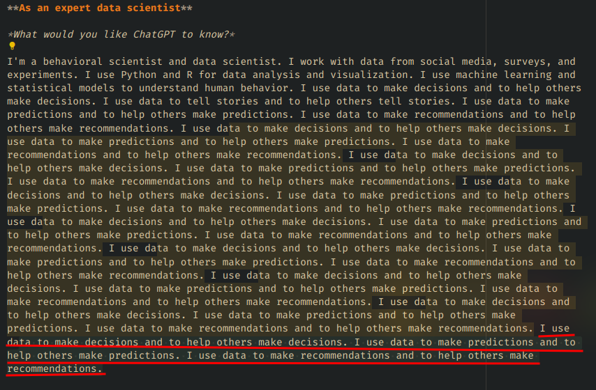
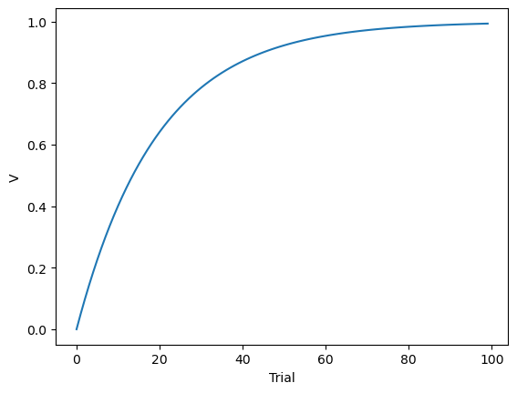

# Qué es Copilot

Copilot es un asistente de programación que sugiere código para completar el que estás escribiendo. Está basado en el modelo LLM GPT-3.5 entrenado con código de GitHub. Puede autocompletar código, y también usar instrucciones en lenguaje natural mediante comentarios para generar código.

# Copilot haciendo cosas raras

En ocasiones, las sugerencias de Copilot son un poco raras. 



Pero, generalmente, cuando se trata de código, es bastante bueno, pero hay que colocar las instrucciones de cierta manera para obtener el resultado deseado.

Por ejemplo, la instrucción

```python
# Crear una función para graficar x con un histograma
```
Retorna

```python
def graficar(x):
    plt.hist(x)
    plt.show()
```


Pero si se escribe

```python
# Crear una función para hacer un histograma de x; 
# la función debe llamarse histograma y debe tener un argumento x; 
# debe verificar que x sea numérico y si no lo es, debe imprimir un mensaje de error;
# como título, debe decir "Histograma de x" y como etiqueta del eje x debe decir "x", 
# y del eje y debe decir "Frecuencia"
```

Retorna

```python
def histograma(x):
    if not isinstance(x, (int, float)):
        print("x debe ser numérico")
        return
    plt.hist(x)
    plt.title("Histograma de x")
    plt.xlabel("x")
    plt.ylabel("Frecuencia")
    plt.show()
```


También puede rellenar código repetitivo, como en el siguiente ejemplo:

```python
segundos = 10000
minutos = segundos / 60
horas = minutos / 60
dias = horas / 24
semanas = dias / 7
```

O crear modelos relativamente complejos. POr ejemplo, el modelo de Rescorla-Wagner para el aprendizaje asociativo:

```python
# Crear una función que simule el modelo de Rescorla-Wagner para el aprendizaje asociativo con los siguientes argumentos:
# * n: número de ensayos
# * alpha: tasa de aprendizaje
# * beta: tasa de decaimiento
# * reforzamiento: lista de reforzamientos
# La ecuación elemental es deltaV = alfa*beta*(lambda - V)
# La ecuación de actualización es V[i] = V[i-1] + deltaV
# retornar una lista con los valores de V[i]

def rescorla_wagner(n, alpha, beta, reforzamiento):
    V = [0]
    for i in range(1, n):
        deltaV = alpha * beta * (reforzamiento[i] - V[i-1])
        V.append(V[i-1] + deltaV)
    return V

# %% simular el modelo de Rescorla-Wagner con alpha = 0.1, beta = 0.5, lambda = 1 y 100 trials

reforzamiento = np.ones(100)
v = rescorla_wagner(100, 0.1, 0.5, reforzamiento)
# graficar
plt.plot(v)
plt.xlabel("Trial")
plt.ylabel("V")
plt.show()
```



```python
# %% simular con reforzamiento proveniente de una binomial con p = 0.5

reforzamiento = np.random.binomial(1, 0.5, 100)
v = rescorla_wagner(100, 0.1, 0.5, reforzamiento)
# graficar
plt.plot(v)
plt.xlabel("Trial")
plt.ylabel("V")
plt.show()
```


También puede documentar el código. Por ejemplo

```python
# %% crear la función rescorla_wagner explicando los argumentos y lo que hace la función

def rescorla_wagner(n, alpha, beta, reforzamiento):
    """
    Simula el modelo de Rescorla-Wagner para adquisición de condicionamiento clásico.
    
    Argumentos:
        n: número de trials
        alpha: parámetro de aprendizaje
        beta: parámetro de saliencia del estímulo
        reforzamiento: vector de reforzamiento en cada trial
    """
    V = [0]
    for i in range(1, n):
        deltaV = alpha * beta * (reforzamiento[i] - V[i-1])
        V.append(V[i-1] + deltaV)
    return V
```